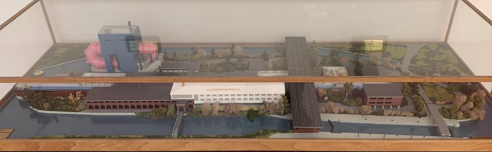
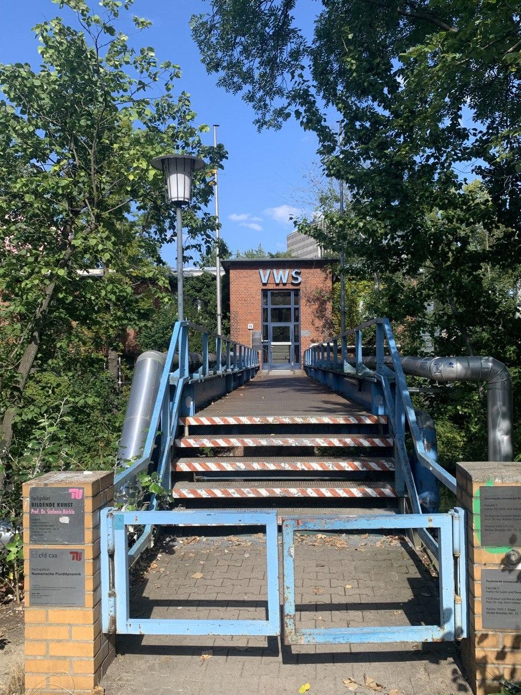

<!--
.. title: Venue
.. slug: venue
.. type: text
.. pagekind: front_page
-->

# Address

<address>
Zentralwerkstatt 
Müller-Breslau-Straße 15 
10623 Berlin 
Germany
</address>

[Google Maps](https://goo.gl/maps/j7n4oHMEkSfu89wVA)

# Getting there

The School takes place at the PC-Pool in room VWS 128. It is located on a small island between canals. The island has a very prominent blue building with large pink tubes, the so-called [Rosa Röhre](https://de.wikipedia.org/wiki/Rosa_R%C3%B6hre). 

One can only enter the VWS building via the *blue bridge* from Müller-Breslau Straße on the south side (leftmost bridge in the model).

The *blue bridge*. Enter the building, go straight up the stairs and immediately left. The PC-Pool VWS 128 is at the end of the hallway.

## From Tiergarten station

Exit the station and walk south. Walk under the bridge to the west side of the train tracks and enter the park southwards. After crossing both canals keep right, walk past the beer garden and go under the tracks again. Enter the building via the blue bridge.

## From Zoologischer Garten station

Use the exit that say Zoo or bus terminal towards the east. Walk northwards with the train tracks on your left and the zoo on you right. Once you arrive at the beer garden turn left and go under the train tracks. If you cross water, you've gone too far. Enter the building via the blue bridge.

